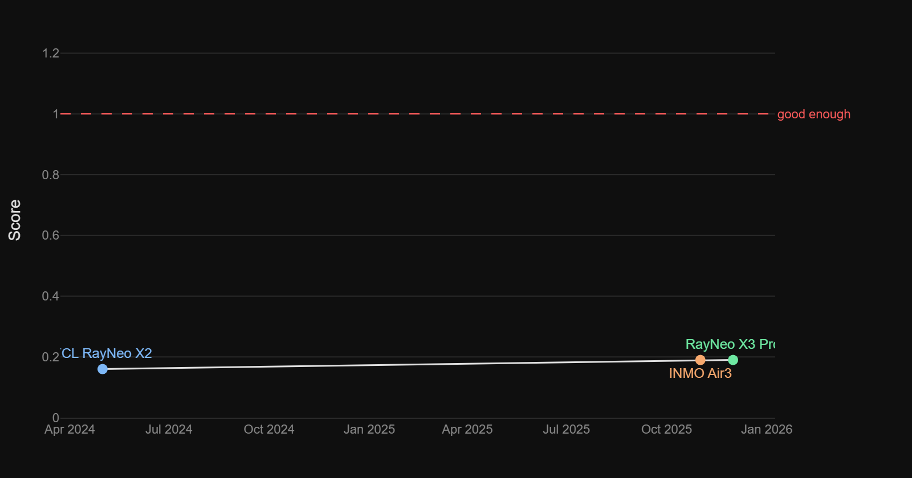

# Good-Enough AR Glasses Metric

The minimum spec combination for AR glasses to function as a genuine daily-driver screen replacement, something you can wear all day and that could meaningfully replace your screens.

## Score Over Time



The score is a **weakest-link metric**: a single failing spec drags the whole product down, regardless of how good the others are.

```
score = min(nits/3000, fov/50, ppd/30, battery/8, 40/weight, 1400/price)
```

A score of 1.0 means the device hits every threshold. Above 1.0 means it exceeds them. The goal is to track progress over time and see when something finally crosses the line.

## Assumptions

Tethered devices are excluded, including compute pucks. This is not just about convenience. A puck-dependent architecture is a fundamentally different product trajectory and likely a dead end rather than a stepping stone toward real AR glasses. Wireless offloading to a smartphone is acceptable, but only because smartphones are a fixture of daily life and not a dedicated accessory bought for the glasses. The glasses must have two full-color displays, one per eye. Vergence-accommodation is assumed to be either solved or set at a comfortable fixed focal distance for desk work. The device must handle normal small head movements without the image breaking. Spatial tracking sufficient to lock virtual content to the real world is assumed as a baseline requirement.

## Targets

| Metric | Good-Enough Target | Notes |
|---|---|---|
| Brightness | 3,000 nits to-eye | Through the waveguide to the eye, not panel brightness |
| Field of View | 50° horizontal | ~equivalent to a 27" monitor at arm's length |
| Weight | 40g | Research-backed ceiling for all-day wear without fatigue |
| Battery Life | 8 hours active display use | Full work day; standby/music figures excluded |
| PPD | 30 pixels per degree | Minimum for comfortable all-day text reading |
| Price | $1,400 (in 2026 dollars) | |

## Devices

| Device | Release Date | Nits (to-eye) | FoV (°) | Weight (g) | Battery (h) | PPD | Price ($) | Score | Bottleneck |
|---|---|---|---|---|---|---|---|---|---|
| TCL RayNeo X2 | May 2024 | 1,000 [*](https://www.xda-developers.com/tcl-rayneo-x2-review/) | 25° [*](https://iksar.pro/en/tcl_rayneo_x2) | 119 [*](https://iksar.pro/en/tcl_rayneo_x2) | 1.25 [*](https://www.xda-developers.com/tcl-rayneo-x2-review/) | 32 [*](https://iksar.pro/en/tcl_rayneo_x2) | 850 [*](https://www.uploadvr.com/rayneo-x2-standalone-ar-glasses-review/) | **0.16** | Battery |
| RayNeo X3 Pro | Dec 2025 | 3,500 [*](https://www.tomshardware.com/peripherals/wearable-tech/rayneo-x3-pro-ar-glasses-review) | 30° [*](https://www.tomshardware.com/peripherals/wearable-tech/rayneo-x3-pro-ar-glasses-review) | 76 [*](https://www.rayneo.com/products/x3-pro-ai-display-glasses) | 1.5 [*](https://www.androidpolice.com/rayneo-x3-pro-review/) | 27 [*](https://www.rayneo.com/products/x3-pro-ai-display-glasses) | 1,099 [*](https://gizmodo.com/rayneo-x3-pro-review-these-ar-glasses-may-haunt-my-dreams-2000699219) | **0.19** | Battery |
| INMO Air3 | Nov 2025 | 600 [*](https://www.inmoxr.com/pages/inmo-air3) | 36° [*](https://www.inmoxr.com/pages/inmo-air3) | 135 [*](https://inmo-air3.gadgetspotr.com/) | 1.5 [*](https://www.kickstarter.com/projects/inmo-air3-ar-glasses/inmo-air3-smart-ar-glasses/faqs) | 62 [*](https://www.inmoxr.com/pages/inmo-air3) | 1,099 [*](https://www.amazon.com/inmo-AIR3-Micro-OLED-Processor-Assistant/dp/B0G25CRXX6) | **0.19** | Battery |

### Score breakdown

| Device | nits/3000 | fov/50 | ppd/30 | battery/8 | 40/weight | 1400/price | **Score** |
|---|---|---|---|---|---|---|---|
| TCL RayNeo X2 | 0.33 | 0.50 | 1.07 | **0.16** | 0.34 | 1.65 | **0.16** |
| RayNeo X3 Pro | **1.17** ✓ | 0.60 | 0.90 | **0.19** | 0.53 | 1.27 | **0.19** |
| INMO Air3 | 0.20 | 0.72 | **2.07** ✓ | **0.19** | 0.30 | 1.27 | **0.19** |

✓ = spec meets or exceeds threshold

Notable: RayNeo X3 Pro is the only device to clear the brightness target (1.17×). INMO Air3 massively exceeds PPD at 2.07×. Battery is the universal bottleneck, every device fails here. No device is anywhere near the FoV or weight targets.


*Last updated: March 2026*
